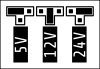

# Fans

This section explains how to figure out what fan you have, and where to connect it.

## Before connecting the fan

Prior connecting, ensure that the fan's maximum current is below the current of 1A (Fan 0/1) or 2A (Fan 2/3).

!!! note

    Please make sure that your fans don't have positive and negative shorted. This can happen easily during installation
    of the toolhead, and happens often behind the fan's label. Therefore, it is good practice to measure continuity
    between the positive and negative fan wires prior powering the printer on.

    While there is some protection of the fan ports, the control element (mosfet) of Fans 0 and 1 can easily blow
    before the protection fuse kicks in.

## Choosing the fan voltage

Use a jumper to select the voltage as indicated below.



## 2-Wire Fans

Those are the most common type of fans in the 3D printer world. Their speed can only be controlled by rapidly turning
connecting and disconnecting either the positive or negative wire. DragonDinghy, like most other 3D printer boards,
switches these fans on the negative side.


You can connect these fans to the 3 pin fan headers (Fan 0 and Fan 1):

| Wire Color (typical) | Fan 0    | Fan 1    |
|----------------------|----------|----------|
| Red                  | F- (PA8) | F- (PB4) |
| Black                | F+       | F+       |

The third connector (TACH) is not used in this scenario.

Example Klipper Section:

```
# These are the example configurations for 2-wire fans on Fan 0 and Fan 1
[fan_generic dinghy_fan0]
pin: dinghy:PA8

[fan_generic dinghy_fan1]
pin: dinghy:PB4
```

!!! note 

    Genuine Sunon -A99 series are notoriously hard to control, often they only spin if the speed is set to 100%, and
    turn off or jitter at 99% or below. People have reported success by adjusting Klipper's `cycle_time` parameter,
    but it is by no means guaranteed that these types of fans can be controlled properly.


## 3-Wire Fans

These fans come with a 3rd wire. Most often, the function of those wires is either tachometer or PWM control. You need
to consult your fan's data sheet/seller page to figure out which function that 3rd wire has.

### 3-Wire Fans with Tachometer
For 3-wire fans with tachometers, you can use Fan 0 and Fan 1: 

| Wire Color (typical)                            | Fan 0       | Fan 1       |
|-------------------------------------------------|-------------|-------------|
| Red                                             | F- (PA8)    | F- (PB4)    |
| Black                                           | F+          | F+          |
| Blue (Delta), White (Orion), Yellow (GdsTime)   | TACH (PC13) | TACH (PC14) |

!!! note

    A diode is already built-in on DragonDinghy, so there is no need to worry about
    the fan spinning or jittering when it's supposed to be off.

Example Klipper Section:

``` { .ini .copy }
# These are the example configurations for Fan 0 and Fan 1
[fan_generic dinghy_fan0]
pin: dinghy:PA8
tachometer_pin: dinghy:PC13

# The following 2 lines are optional, please read the note below
# tachometer_ppr: 2
# tachometer_poll_interval: 0.0009

[fan_generic dinghy_fan1]
pin: dinghy:PB4
tachometer_pin: dinghy:PC14

# The following 2 lines are optional, please read the note below
# tachometer_ppr: 2  
# tachometer_poll_interval: 0.0009
```

!!! note

    `tachometer_ppr` specifies how many impulses per one full fan rotation the fan outputs. That is almost always 2, if
    you have set your `tachometer_poll_interval` correctly, check the fan's datasheet if it uses a different value.

    `tachometer_poll_interval` specifies how often Klipper reads the tachometer pin. The value must be lower than
    `30/(tachometer_ppr*rpm)`. For example, the Delta ASB02505SHA-AY6B requires a poll interval of `0.0009`. Don't use
    arbitarily small values, as this requires additional computational time on the MCUs and can lead to a
    `Timer too close` if improperly configured. 


### 3-Wire Fans with PWM
For 3-wire fans with pwm, you can use Fan 2 and Fan 3. The PWM connector position stays empty in this scenario.

| Wire Color (typical)                          | Fan 2       | Fan 3       |
|-----------------------------------------------|-------------|-------------|
| Red                                           | F-          | F-          |
| Black                                         | F+          | F+          |
| Yellow (Delta), Blue (GdsTime, Orion)         | PWM (PA4)   | PWM (PB14 ) |


Example Klipper Section:

``` { .ini .copy }
# These are the example configurations for Fan 0 and Fan 1
[fan_generic dinghy_fan2]
pin: dinghy:PA4

[fan_generic dinghy_fan3]
pin: dinghy:PB14
```

## 4-Wire Fans

These fans come with 4 wires. Almost always, the additional wires functions for PWM control and tachometer feedback.


These fans go to the Fan 2 and Fan 3 connectors:

| Wire Color (typical)                          | Fan 2       | Fan 3       |
|-----------------------------------------------|-------------|-------------|
| Red                                           | F-          | F-          |
| Black                                         | F+          | F+          |
| Blue (Delta), White (Orion), Yellow (GdsTime) | TACH (PC15) | TACH (PB15) |
| Yellow (Delta), Blue (GdsTime, Orion)         | PWM (PA4)   | PWM (PB14)  |


Example Klipper Section:

``` { .ini .copy }
# These are the example configurations for Fan 0 and Fan 1
[fan_generic dinghy_fan2]
pin: dinghy:PA4
tachometer_pin: dinghy:PC15

# The following 3 lines are optional, please read the note below
# cycle_time: 0.00004
# tachometer_ppr: 2
# tachometer_poll_interval: 0.0009

[fan_generic dinghy_fan3]
pin: dinghy:PB14
tachometer_pin: dinghy:PB15

# The following 3 lines are optional, please read the note below
# cycle_time: 0.00004
# tachometer_ppr: 2  
# tachometer_poll_interval: 0.0009
```

!!! note

    `tachometer_ppr` specifies how many impulses per one full fan rotation the fan outputs. That is almost always 2, if
    you have set your `tachometer_poll_interval` correctly, check the fan's datasheet if it uses a different value.

    `tachometer_poll_interval` specifies how often Klipper reads the tachometer pin. The value must be lower than
    `30/(tachometer_ppr*rpm)`. For example, the Delta ASB02505SHA-AY6B requires a poll interval of `0.0009`. Don't use
    arbitarily small values, as this requires additional computational time on the MCUs and can lead to a
    `Timer too close` if improperly configured.

    `cycle_time` specifies the PWM base frequency. Most PC and server fans expect a 25kHz signal, equalling to
    `cycle_time: 0.00004`


## Troubleshooting

### Fans not spinning

- Ensure that the polarity of the wires is correct.
- Check the voltage status LEDs, they should all be lit

- Check that the `Pin On` LED is lit when you activate the fan.
 
      - If it doesn't light up, you might have the pins set incorrectly. Consult the Klipper log to check that the pins are
        actually set to what you expect them to be set.

#### Fans 0 and 1

- Check that the `Output On` LED is lit when you activate the fan. If it doesn't light up:

      - Ensure the fan voltage jumper is set
      - Ensure the fan is actually connected
      - If the previous checks come back false, then the protection fuse might be blown. This only happens when a severe
        overload happened, for example a short circuit or attempting to run a fan which exceeds the current rating of 1A.
        This fuse is not user replaceable, as other components in that part of the circuit might have taken damage. 

### Fan spinning uncommanded

#### Fans 0 and 1

Check the LEDs of the fan port. If the `Pin On` LED is lit, then something has commanded the fan to spin. This is
typically a misconfiguration or macro on the Klipper side. If `Output On` LED is lit but `Pin On` is not, then the
output has experienced a brief overload (typically a short circuit), fast enough to damage the control element (mosfet)
but not triggering the protection fuse.

#### Fans 2 and 3

Most PWM fans start up at full power until Klipper has started and initialized the MCU board(s). To prevent this,
you can set initial pins in your `make menuconfig` section like so:


### PWM fans not properly controllable

Many PWM fans designed for use within computers or servers (GdsTime GDP4028, Noctua Fans, almost all PC fans) expact
a 25kHz signal. To implement this, add the following line to your PWM fan section: 

```ini
cycle_time: 0.00004
```

## Appendix
### Typical Fan Wire Colors

This table was written with the most common 3D printer fan models/types in mind. Note that sometimes manufacturers vary
the wire colors by fan model or target audience, so you might want to double-check the fan's data sheet for the most
accurate information.

| Function          | Colors                                        |
|-------------------|-----------------------------------------------|
| Red               | Positive supply voltage                       |
| Black             | Negative / GND                                |
| Tachometer        | Blue (Delta), White (Orion), Yellow (GdsTime) |
| PWM Speed Control | Yellow (Delta), Blue (GdsTime, Orion)         |
| Alarm             | Yellow (Orion)                                |
