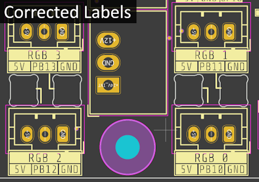

# Known Issues

## Beta Versions

### Rev A (2024-05-21)

This is the very first revision, shipped to testers only.

#### Issues affecting the users
- Wrong crystal fitted (12MHz instead of 8MHz). Choose 12 MHz in Klipper's `make menuconfig`. 
  A paper label has been placed on the board to document the proper settings.
  
- Reverse polarity protection circuit has been bypassed as reworking would've been too tedious.

- Silkscreen for the RGB headers is flipped 180° (5V is GND and GND is 5V).
  Has been blackened out on the shipped out boards

  

#### Issues that need to be reworked
- Wrong footprint for the constant current mirror
- Wrong footprint for the reverse polarity protection P-channel mosfet
- Replace 4 pin input connector with an option for a 6 pin input connector, so that 12V and 5V can be supplied
  externally without the need for the on-board step-down converters - saves a bit of cost and the board can be provided
  in 2 variants, depending on the needs of the user

#### QoL issues
- RGB indicator LEDs are very bright
- RGB indicators should be channel 0,1 and 2,3 instead of 1,0 and 3,2
- Silkscreen hardly readable in several places
- Silkscreen should be rotated in one direction
- RGB debug LED cutouts are not perfectly aligned
- Step-Down Converters are very close to the RGB and extension headers

#### Production Issues
- SMD fuse is very close to through-hole pin headers. Move fuse to make soldering easier
- JST PH Holes are a bit too big, making the connectors fall out
- Step-Down Converter holes are way too big
- Step-Down Converters could be fixated in place by a drop of silicone, but there's little space to do so
